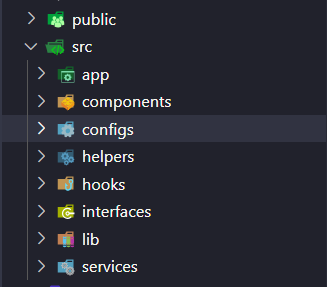

<h1 align="center"> IE204.N01 - IE213.N06 </h1> <br>
<!-- <p align="center">
  <a href="https://gitpoint.co/">
    
  </a>
</p> -->

<p align="center">
  GitHub in your pocket. Built with <a href="https://nextjs.org/">NextJS 14</a>.
</p>


<!-- START doctoc generated TOC please keep comment here to allow auto update -->
<!-- DON'T EDIT THIS SECTION, INSTEAD RE-RUN doctoc TO UPDATE -->
## Table of Contents

- [Introduction](#introduction)
- [Team members](#team-members)
- [Project management](#project-management)
  - [Git workflow](#git-workflow)
  - [Github project](#github-project)
  - [Folder structure](#folder-structure)
  - [Process](#process)
- [Tech stack](#tech-stack)
- [Run in development mode](#run-in-development-mode)
- [Release](#release)

<!-- END doctoc generated TOC please keep comment here to allow auto update -->

## Introduction

Write something...

## Team members

| Họ và tên          | Mã số sinh viên |
|--------------------|-----------------|
| Trương Thiên Lộc   | 21520330        |
| Phan Đình Thế Trung| 21520504        |
| Phan Thanh Dương   | 21520762        |
| Trần Đình Khánh    | 21520984        |
| Phạm Thanh Duy     | 21522008        |
| Hồ Nhật Huy        | 21522140        |

## Project management

### Git workflow

- **main**: Không được phép push trực tiếp vào nhánh này mà phải thông qua PR. Nhánh này chỉ nhận PR từ nhánh **release/\***. Được sử dụng để deploy sản phẩm.
- **develop**: Không được phép push trực tiếp vào nhánh này mà phải thông qua PR.
- Các nhánh khác phải đặt tên dưới dạng: *{type}/{name}*. Trong đó:
  - *type:* feature | fixbug | release | doc | hotfix | ...
  - *name:* Một cái tên ngắn gọn về công việc thực hiện (Ví dụ: HomePage | home-page | home_page).


### Github project

Ý nghĩa các bảng:

- *Backlog:* chứa các task hoặc yêu cầu được sắp xếp sẵn để tiếp tục phát triển trong tương lai.
- *Ready:* chứa các task từ bảng Backlog đã được chấp nhận và sẵn sàng để bắt đầu thực hiện.
- *In progress:* chứa các task mà nhóm đang hoặc đã bắt đầu thực hiện. Các task trong bảng này đang trong quá trình phát triển hoặc triển khai và đang chờ được hoàn thành.
- *In review:* chứa các task mà task đã hoàn thành và đang được xem xét hoặc kiểm tra.
- *Done:* chứa các task đã hoàn thành và được chấp nhận.

Quy tắc:

- *Backlog* -> *Ready* và *In review* -> *Done*: sẽ do **PM** thực hiện.
- *Ready* -> *In progress* -> *In review*: sẽ do **Dev** thực hiện.

Quy ước:

- *Backlog* -> *Ready* -> *In progress*: sẽ được thực hiện **thủ công**.
- *In review* -> *Done*: sẽ được thực hiện **tự động**.

### Folder structure

Đầu tiên, folder structure cần phải tuân thủ theo các pattern của NextJS 14:
- [Project structure - App Routing Conventions](https://nextjs.org/docs/getting-started/project-structure#app-routing-conventions)
- [NextJS 14 Routing](https://nextjs.org/docs/app/building-your-application/routing)

Tiếp theo, folder structure sẽ bao gồm các folder như sau:



### Process

Khi ở local:
- Tạo nhánh *feature/{name}* từ nhánh *develop* (với {name} là tên của task, đặt tên ngắn gọn, dễ hiểu).
- Dev sẽ thực hiện công việc của mình trên nhánh *feature/{name}*.
- Khi commit, comment với định dạng sau: "feature(*{name}*): *{description}*" (tất cả đều phải viết dưới dạng lower-case). Ví dụ:
```shell
git commit -m "feature(home-page): create hero section in home page"
```
- Sau khi commit, hệ thống sẽ tự động thực hiện các công việc sau:
  - Tự động format code.
  - Kiểm tra cú pháp code. Nếu có lỗi cú pháp, commit sẽ thất bại.
  - Check commit (phần comment). Nếu không đúng định dạng, commit sẽ thất bại. 
- Khi push code lên remote repo, thực hiện push code lên đúng branch đã tạo ở local.

Khi ở remote repo:
- Khi muốn merge code vào nhánh develop, không được phép merge trực tiếp, mà phải thông qua **pull request**.
- Khi tạo pull request (PR), sẽ có description template, điền các thông tin quan trọng, đặc biệt là *Related Issue #{task_id}* (thông tin cho biết pull request là của task nào?) và *Closes #{task_id}* (tương tự như *Related Issue*, nhưng chỉ để task_id nếu task done).
  - Trường assignees phải assign ít nhất là chính mình (có thể assign thêm các thành viên khác nếu thành viên đó có đóng góp trong PR đó).
  - Trường reviewers phải để người review (thường là PM).
- Sau khi tạo PR, hệ thống sẽ test code và reviewers chỉ được phép merge khi test thành công.

## Tech stack

## Run in development mode

Write something...

## Release

Write something...
